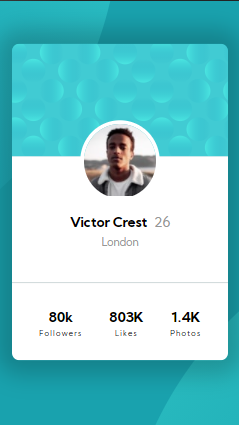

# Frontend Mentor - Profile card component solution

https://Iamronaldosunmu.github.io/Profile-Card-Component -view the live site here

This is a solution to the [Profile card component challenge on Frontend Mentor](https://www.frontendmentor.io/challenges/profile-card-component-cfArpWshJ)
## Table of contents

- [Frontend Mentor - Profile card component solution](#frontend-mentor---profile-card-component-solution)
  - [Table of contents](#table-of-contents)
  - [Overview](#overview)
    - [The challenge](#the-challenge)
    - [Screenshot](#screenshot)
    - [Links](#links)
  - [My process](#my-process)
    - [Built with](#built-with)
    - [What I learned](#what-i-learned)
    - [Continued development](#continued-development)
    - [Useful resources](#useful-resources)
  - [Author](#author)

## Overview
This is a profile card component that I built shortly after learning Html and Css

### The challenge

- Build out the project to the designs provided

### Screenshot

### Links

- Live Site URL: (https://Iamronaldosunmu.github.io/Profile-Card-Component)

## My process
I started off by identifying the components that I'd need to build.
I built each component seperately and put them all together in the final result.
### Built with

- Semantic HTML5 markup
- CSS custom properties
- Flexbox
- Mobile-first workflow

### What I learned
I learned how to arrange components properly in a component using flex.

### Continued development
I've worked on so many projects already but I just started uploading them to my github. I can't wait for you guys to have a look!

### Useful resources

Mosh hamedani's ultimate Html and Css course was the biggest resource for this project.

## Author

- Twitter - [@IamRonald05](https://www.twitter.com/IamRonald05)
- Instagram - [@iamthatronaldosunmu]

